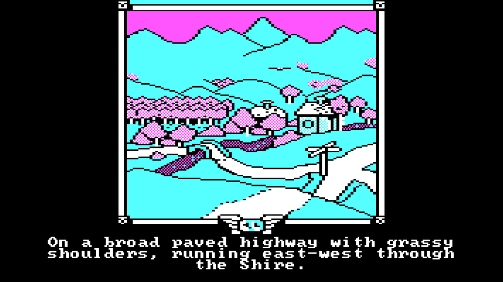

Bild: Screenshot “Lord of the Rings: Game One”, 1986

Heute vor 72 Jahren erschien Band eins von J. R. R. Tolkiens *The Lord of the Rings* auf dem britischen Buchmarkt. Unter dem Titel *The Fellowship of the Ring* begann damit eine Geschichte, die das Fantasy-Genre für immer prägen sollte. Auch wenn heutzutage vielen Menschen gar nicht bewusst ist, dass die Filme und Spiele tatsächlich eine Buchvorlage haben.

*Lord of the Rings: Game One* – in Nordamerika unter dem Titel *The Fellowship of the Ring: A Software Adventure* veröffentlicht gehört zu den frühen Versuchen, die Welt von Tolkien auf den Computer zu portieren. Es wurde vom australischen Entwicklerstudio Beam Software entwickelt und erschien zwischen 1985 und 1986 für Plattformen wie den ZX Spectrum, den Commodore 64, den Amstrad CPC und weitere Systeme. Es war der offiziell lizenzierte Nachfolger des 1982 sehr erfolgreich produzierten *The Hobbit*, das seinerzeit ein großer Erfolg war. Genau wie sein Vorgänger war auch dieses Spiel ein illustriertes Text-Adventure, in dem man kurze Befehle wie “*GO NORTH*”, “*TAKE SWORD*”, “*TALK TO GANDALF”* eingibt – und als Antwort beschreibende Textpassagen erhält. Manchmal auch nur die Anwort, dass der Befehl nicht verstanden worden ist. Ich glaube, das Spiel versteht um die 400 Wörter, zuviel darf man also nicht erwarten. Dafür ist das Spielsystem recht innovativ: Man kann nicht nur Frodo steuern, sondern auch die Perspektive wechseln, und das Spiel aus der Sicht von Sam, Merry oder Pippin spielen. Das ist für Spiel von 1986 schon bemerkenswert.

*Game One* deckte nicht die gesamte Trilogie ab, sondern konzentriert sich auf den ersten Band. Der Spielverlauf führt vom Auenland über die Flucht vor den Schwarzen Reitern bis hin zu den Minen von Moria und der Begegnung mit dem Balrog, letztlich bis zur Ankunft bei Galadriel in Lórien. Dabei bleibt das Spiel immer nah an der Buchvorlage, nimmt sich aber auch gewisse Freiheiten, die ein Spiel interessant machen. Als besonderes Gimmick wurde das Spiel mit einer Taschenbuchausgabe des Buches verkauft. O, glückliche Zeiten, als Computerspiele noch physisch in einer Verpackung verkauft wurden!

Im [Internet Archiv](https://archive.org/details/msdos_Fellowship_of_the_Ring_The_-_Part_1_1986) kann man die DOS-Version online spielen, eine [Anleitung](https://ifdb.org/viewgame?id=tpagbmkmud7cl3uz) gibt es auch. Im [Tolkien-Shop](https://www.tolkienshop.com/contents/en-uk/p6224.html) gibt es sogar noch Originale des Spiels, wahrscheinlich für den ZX Spectrum, zu kaufen.
